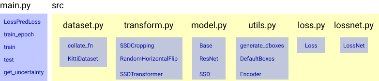
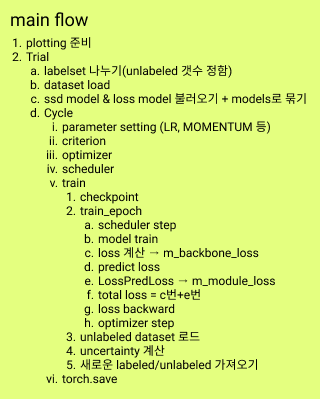

**jungyeon working directory**

> BEFORE running the code, you have to download Kitti dataset! And then, change the dataset directory in `main.py`. [Download](http://www.cvlibs.net/datasets/kitti/eval_object.php?obj_benchmark=2d)

## Setting Virtual Environment with Anaconda

`conda create -n [VIR_ENV_NAME] python==3.8`

`conda activate [VIR_ENV_NAME]`

`pip install -r requirements.txt`

`python main.py`

If you can run `main.py`, the setting is done.

# Active Learning for EFFICIENT Learning
## Goals: random sampling VS. confidence VS. LL4AL

0. SSD(ResNet50) + Kitti(Object detection) + Confidence

1. SSD(ResNet50) + Kitti(Object detection) + Learning loss
    - Learning loss code [Github](https://github.com/Mephisto405/Learning-Loss-for-Active-Learning)
    - SSD(ResNet50) [Github](https://github.com/uvipen/SSD-pytorch)
    - Wandb [Github](https://github.com/borisdayma/lightning-kitti)
    - Kitti parameter [Github](https://github.com/seonghoon247/SSD-KITTI/blob/master/nets/ssd_vgg_384x1280.py)
    - [maybe later](https://discuss.pytorch.org/t/solved-pytorch1-5-runtimeerror-one-of-the-variables-needed-for-gradient-computation-has-been-modified-by-an-inplace-operation/90256/7?fbclid=IwAR2qafREIOGt2vekmEE6cF0uVyoLQgoMerAWMHPIl3KVNt1vqup02T3lgnU) : PyTorch 1.5.0 이상 버전에서 model weight update와 관련된 inplace operation이 수정되면서 zero_grad -> backward -> step의 과정이 최적화하고자 하는 변수의 순서에 맞춰서 수행되어야 해결되는 것으로 알고 있습니다.
    
    
    
    

---

## Reference

### SSD
1. [[논문] SSD: Single Shot Multibox Detector 분석](https://taeu.github.io/paper/deeplearning-paper-ssd/)
2. [갈아먹는 Object Detection [6] SSD](https://yeomko.tistory.com/20)
3. [mAP 계산하기](https://herbwood.tistory.com/3)
4. [Object Detection](https://github.com/hoya012/deep_learning_object_detection)
5. [Object-Detection-Object-Detection-튜토리얼](https://rain-bow.tistory.com/entry/Object-Detection-Object-Detection-%ED%8A%9C%ED%86%A0%EB%A6%AC%EC%96%BC)
6. [Object detection: speed and accuracy comparison (Faster R-CNN, R-FCN, SSD, FPN, RetinaNet and YOLOv3)](https://jonathan-hui.medium.com/object-detection-speed-and-accuracy-comparison-faster-r-cnn-r-fcn-ssd-and-yolo-5425656ae359)
7. [Deep Learning for Generic Object Detection: A Survey](https://arxiv.org/pdf/1809.02165v1.pdf)
8. [a-PyTorch-Tutorial-to-Object-Detection](https://github.com/sgrvinod/a-PyTorch-Tutorial-to-Object-Detection)
9. [nvidia_deeplearningexamples_ssd](https://pytorch.org/hub/nvidia_deeplearningexamples_ssd/)

### AL
1. [Learning Loss for Active Learning](https://arxiv.org/abs/1905.03677) : base
2. [Learning to Rank for Active Learning: A Listwise Approach](https://ieeexplore.ieee.org/document/9412680)

### KITTI
1. [kitti vis code](https://github.com/bostondiditeam/kitti/blob/master/tools/2D_BBox.ipynb) : random_vis.py 코드
2. [kitti label](https://github.com/bostondiditeam/kitti/blob/master/resources/devkit_object/readme.txt) : 라벨링 정보
3. [kitti dataloader pytorch](https://github.com/dusty-nv/pytorch-depth/blob/master/dataloaders/kitti_dataloader.py) : dataset.py

---

## ETC
- [argparse](https://m.blog.naver.com/cjh226/220997049388)

> if time permits

### +RL
- [Learning how to Active Learn: A Deep Reinforcement Learning Approach](https://arxiv.org/abs/1708.02383) 

### +SSL
- [Multiple Instance Active Object Detection (MI-AOD)](https://github.com/yuantn/MI-AOD) 
- [Unbiased Teacher for Semi-Supervised Object Detection](https://ycliu93.github.io/projects/unbiasedteacher.html)
