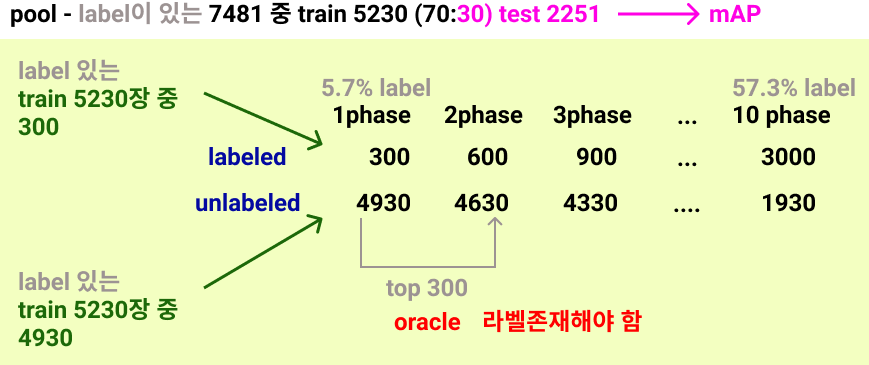

**jungyeon working directory**

# Active Learning for EFFICIENT Learning
## Goals
0. Confidence 기반 구현 먼저(08.18)

1. SSD(ResNet50) + Kitti(Object detection) + Learning loss
    - base paper code [Github](https://github.com/Mephisto405/Learning-Loss-for-Active-Learning)
    - ssd code [Github](https://github.com/uvipen/SSD-pytorch)
    - issue
        - (08.06) kitti preprocessing
        - (08.06) loss module을 위한 feature 뽑아내기
        - (08.03) (maybe later) https://pytorch.org/docs/stable/optim.html#how-to-adjust-learning-rate
        
    

2. 

---
# Table
- Papers & Articles
    - `OB`
    - `AL`
    - `+RL`
    - `+SSL`
- Code Reference
    - `KITTI`
    - `SSD`
    - `ETC`

---

## Papers & Articles
### OB
- [Deep Learning for Generic Object Detection: A Survey](https://arxiv.org/pdf/1809.02165v1.pdf)
- [Object Detection](https://github.com/hoya012/deep_learning_object_detection)
- [Object detection: speed and accuracy comparison (Faster R-CNN, R-FCN, SSD, FPN, RetinaNet and YOLOv3)](https://jonathan-hui.medium.com/object-detection-speed-and-accuracy-comparison-faster-r-cnn-r-fcn-ssd-and-yolo-5425656ae359)
- [Object-Detection-Object-Detection-튜토리얼](https://rain-bow.tistory.com/entry/Object-Detection-Object-Detection-%ED%8A%9C%ED%86%A0%EB%A6%AC%EC%96%BC)

### AL
- [1] [Learning Loss for Active Learning](https://arxiv.org/abs/1905.03677) : base
- [2] [Learning to Rank for Active Learning: A Listwise Approach](https://ieeexplore.ieee.org/document/9412680)

> if time permits

### +RL
- [Learning how to Active Learn: A Deep Reinforcement Learning Approach](https://arxiv.org/abs/1708.02383) : oracle에게 물어볼지를 action으로 적용한 nlp

### +SSL
- [Multiple Instance Active Object Detection (MI-AOD)](https://github.com/yuantn/MI-AOD) : 아직 이해 못함. 근데 적용해보면 좋을 듯
- [Unbiased Teacher for Semi-Supervised Object Detection](https://ycliu93.github.io/projects/unbiasedteacher.html):ssd에는 안 맞긴 한데 아이디어 참고용

---

## Reference

### KITTI
- [kitti vis code](https://github.com/bostondiditeam/kitti/blob/master/tools/2D_BBox.ipynb) : random_vis.py 코드
- [kitti label](https://github.com/bostondiditeam/kitti/blob/master/resources/devkit_object/readme.txt) : 라벨링 정보
- [torchvision kitti](https://pytorch.org/vision/master/_modules/torchvision/datasets/kitti.html) : 중간에 계속 끊겨서 그냥 페이지에서 신청해서 다운 받음
- [kitti dataloader pytorch](https://github.com/dusty-nv/pytorch-depth/blob/master/dataloaders/kitti_dataloader.py) : 데이터 로더 참고

### SSD
- [nvidia_deeplearningexamples_ssd](https://pytorch.org/hub/nvidia_deeplearningexamples_ssd/) : ssd모델 그냥 불러오는 것 같은데 어떻게 수정할 수 있는지 모르겠음
- [a-PyTorch-Tutorial-to-Object-Detection](https://github.com/sgrvinod/a-PyTorch-Tutorial-to-Object-Detection)

### ETC
- [argparse](https://m.blog.naver.com/cjh226/220997049388)